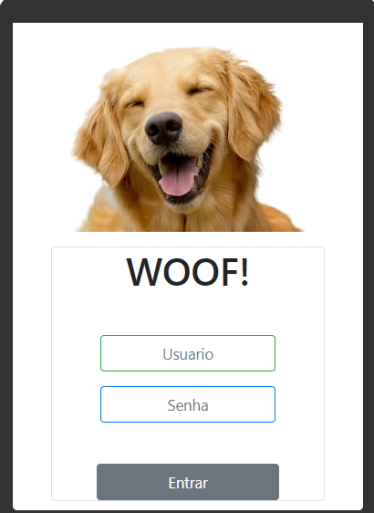
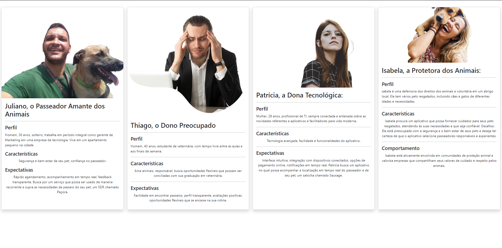

##PROJETO INTEGRADOR: DESdENVOLVIMENTO DE SISTEMAS ORIENTADOS A DISPOSITIVOS MÓVEIS E BASEADOS NA WEB##

**Integrantes do grupo:** 
- CARLOS HENRIQUE DE CASTRO CAAMANO
- JANAINA CONCEICAO TAVARES DA SILVA
- JULIANO LOPES DOS SANTOS
- LEANDRO GONÇALVES REIS
- MATHEUS MAURICIOA
- RICARDO PEREIRA RODRIGUES
- SEBASTIÃO BARBOSA PEREIRA JUNIOR

**Professor:** Jean Carlo Wagner

1 - **Objetivos:**
Desenvolver um aplicativo de passeio de pets que ofereça uma experiência única e confiável para os usuários, proporcionando facilidade, segurança e conexão emocional entre donos de animais de estimação e os cuidadores.
